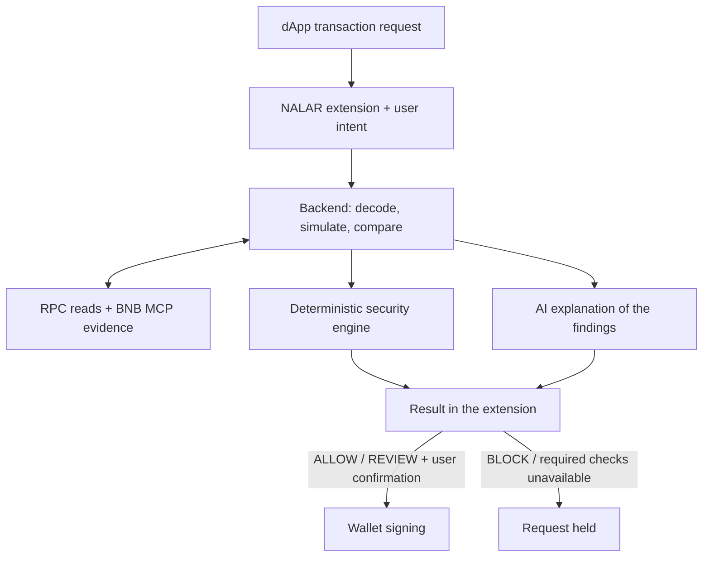

<p align="center">
  <picture>
    <source media="(prefers-color-scheme: dark)" srcset="frontend/public/brand/n-dark.svg">
    
  </picture>
</p>

<h1 align="center">NALAR Protocol</h1>

<p align="center">
  <strong>Know what you're signing.</strong><br>
  Understand a Web3 transaction before it reaches your wallet.
</p>

<p align="center">
  <a href="https://www.usenalar.xyz">Website</a> ·
  <a href="https://www.usenalar.xyz/demo">NFT demo</a> ·
  <a href="https://www.usenalar.xyz/address">On-chain Explainer</a> ·
  <a href="https://www.usenalar.xyz/install">Install extension</a>
</p>

---

NALAR is a browser extension and a set of tools for understanding activity on BNB Smart Chain. You describe what you want to do. Before a transaction is sent to your wallet, NALAR compares that intent with the request, simulates execution, reads available on-chain evidence, and explains the result.

The security decision comes from a **deterministic engine**: rules applied to the available evidence. AI helps explain the findings in everyday language. BNB MCP supplies additional blockchain evidence; it does not make the final decision.

[How it works](#how-it-works) · [Try the demo](#try-the-nft-demo) · [Run locally](#run-locally) · [Repository guide](#repository-guide) · [Checks and tests](#checks-and-tests)

## Three ways to use NALAR

| Tool | What it does | Where to find it |
| --- | --- | --- |
| **Browser extension** | Checks a transaction before wallet signing. Shows the verdict, intent comparison, explanation, and supporting evidence. | [Extension source](extension/) |
| **On-chain Explainer** | Explains a wallet address, contract address, or transaction hash. Supports follow-up questions and English/Indonesian explanations. | Website `/address` |
| **NFT demo** | Lets you compare a real NFT mint with a request that grants NFT permission instead. | Website `/demo` |

The Explainer is a separate, read-only tool. It does not require a connected wallet and does not issue a risk score or an `ALLOW`, `REVIEW`, or `BLOCK` decision.

## How it works

1. **Describe your intent.** For example: “Mint one Nalar NFT.”
2. **Decode the request.** NALAR reads the target, function, arguments, and value.
3. **Simulate and investigate.** The backend checks execution, expected effects, contract capabilities, and available on-chain state. BNB MCP can enrich these findings.
4. **Compare and decide.** The security engine compares the request with your intent and applies its risk and policy rules.
5. **Explain before signing.** The extension shows the result. An allowed or reviewable request reaches the wallet only after you choose to continue.



### Reading the result

| Decision | Meaning | What happens next |
| --- | --- | --- |
| **ALLOW** | No blocking condition was found in the completed checks. | You can review the explanation and choose to continue to the wallet. |
| **REVIEW** | A finding, uncertainty, or intent mismatch needs your attention. | Explicit confirmation is required before continuing. |
| **BLOCK** | The security rules found a condition that prevents the request from continuing. | The transaction is not forwarded to the wallet. |

When protection is active, a failed required check, invalid response, unsupported network, or timeout must not become an approval. Pausing NALAR allows requests to pass through without its checks.

The popup controls network, protection, theme, and saved site intent. Transaction intent, progress, and results appear as overlays on the dApp page. Technical details are expandable, and AI-generated explanations are labelled separately from the verdict.

## Networks and scope

| Network | Chain ID | Native asset | Explorer |
| --- | --- | --- | --- |
| BNB Smart Chain Testnet | `97` | `tBNB` | [Testnet BscScan](https://testnet.bscscan.com) |
| BNB Smart Chain Mainnet | `56` | `BNB` | [BscScan](https://bscscan.com) |

Both networks are supported by the current code. The NFT demo contracts are **Testnet-only**. Validate the deployed backend, RPC, and MCP configuration for the chosen chain before relying on a production deployment; local support is not proof that a deployed version has been updated.

The extension currently intercepts `eth_sendTransaction`. It includes provider handling for `window.ethereum`, Rabby, and EIP-6963 discovery. This is not coverage for every wallet signing method, and real-wallet compatibility still needs testing. See the [wallet QA checklist](extension/tests/real-wallet-qa.md).

## Try the NFT demo

1. Download the [extension archive](https://github.com/BayuDivaA/nalar-extension/archive/refs/heads/main.zip), or use this repository's `extension/` folder.
2. Open `chrome://extensions`, enable **Developer mode**, and choose **Load unpacked**. Select the folder containing `manifest.json`.
3. Keep NALAR **Active**, select **BNB Testnet**, and connect a test wallet with enough `tBNB` for gas.
4. Open the [demo](https://www.usenalar.xyz/demo), choose a scenario at the top, and describe your intent when NALAR prompts you.

The collection, **Nalar Editions**, has a maximum supply of **888 NFTs**. Its artwork uses the NALAR logo, with SVG images and metadata generated on-chain. The page reads collection details, price, supply, and the approval-trap request from the contracts.

| Scenario | Actual transaction | What to inspect in NALAR |
| --- | --- | --- |
| **Normal mint** | Calls `safeMint()` with the price read from the collection. | Whether the transaction matches your mint intent. |
| **Approval trap** | Calls `setApprovalForAll(operator, true)` on the demo collection. It does not mint an NFT. | The difference between minting and granting collection-wide transfer permission. |

The trap grants a real permission if signed. It is restricted to the Testnet demo collection and should be tested with a test wallet. The demo does not hardcode a security verdict; the backend evaluates the actual request and available evidence.

## Explore an address or transaction

On the [On-chain Explainer](https://www.usenalar.xyz/address), choose a network and paste an EVM address or transaction hash.

- **Address:** see available contract or account observations, on-chain values, and callable functions when an ABI is available. An ABI is the description of a contract's callable interface.
- **Transaction hash:** see the sender, target, native value, decoded function and arguments when available, and recorded receipt or event details.
- **Follow-up questions:** ask what a function or observation means. Explanations use the current address or transaction context, with English and Bahasa Indonesia available.

Missing ABI or source information is shown as a limitation. A function list is not the complete contract implementation, and an address lookup alone does not establish its transaction history. The Explainer describes known facts and what remains unknown.

## Repository guide

| Directory | Responsibility | Main tools |
| --- | --- | --- |
| [`extension/`](extension/) | Popup, dApp overlays, provider interception, storage, and backend messaging | Manifest V3, JavaScript, Framer Motion bundle |
| [`backend/`](backend/) | Intent analysis, simulation, evidence, security decisions, and explanations | TypeScript, Bun, Hono, viem, Zod |
| [`frontend/`](frontend/) | Landing page, install guide, NFT demo, and On-chain Explainer | Next.js, React, TypeScript, Tailwind CSS |
| [`bnb-mcp/`](bnb-mcp/) | Authenticated gateway for the official BNB Chain MCP server | Express, `@bnb-chain/mcp`, SSE |
| [`contract/`](contract/) | Demo NFT collection, approval trap, deployment scripts, and tests | Solidity, OpenZeppelin, Foundry |
| [`docs/`](docs/) / [`plan/`](plan/) | Deployment notes and implementation plans | Markdown |

Some filenames and API metadata still use **TxSentry**, the project's earlier internal name.

## Run locally

### Requirements

- Bun. The frontend pins Bun `1.4.0` in its package configuration.
- Node.js and npm. The MCP gateway declares Node.js `20+`.
- Chrome or another Chromium browser, plus a compatible wallet for the transaction demo.
- BNB RPC access. AI explanations also need a configured AI provider.
- Foundry, only if you want to test or deploy the Solidity contracts.

```bash
git clone https://github.com/BayuDivaA/nalar-protocol.git
cd nalar-protocol
```

Each application has its own dependencies and environment file. The copy commands below preserve an existing local file.

### 1. Start the backend

```bash
cd backend
bun install
cp -n .env.example .env
```

Configure `backend/.env` using the [backend template](backend/.env.example):

| Setting | Purpose |
| --- | --- |
| `BNB_RPC_URL` | Testnet RPC endpoint. |
| `BSC_TESTNET_RPC_URL` | Optional explicit Testnet override, used before `BNB_RPC_URL`. |
| `BSC_MAINNET_RPC_URL` | Mainnet RPC override. The backend does not read `BNB_MAINNET_RPC_URL`. |
| `AI_PROVIDER`, `AI_API_KEY`, `AI_MODEL` | AI provider credentials and model. Supported provider values include `gemini`, `openrouter`, `openai`, and `heuristics`. |
| `BNB_INVESTIGATOR_ENABLED` | Set to `true` to enable BNB MCP investigation. |
| `BNB_MCP_TRANSPORT` | Use `stdio` for the local MCP subprocess, or `sse` for a remote gateway. |
| `FRONTEND_ORIGIN` | Allowed browser origins, comma-separated when needed. Local development origins are already allowed. |

Leave unused optional overrides unset instead of assigning an empty URL. With `stdio`, the backend launches the MCP package through `npx`; a separate gateway process is not needed. Package download and blockchain reads require network access.

```bash
PORT=3001 bun run dev
```

The API is available at `http://localhost:3001`. `GET /api/health` reports service status and a Testnet RPC probe; it does not verify Mainnet or all analysis dependencies.

### 2. Start the website

From the repository root, in a second terminal:

```bash
cd frontend
bun install
cp -n .env.example .env.local
```

Set `NEXT_PUBLIC_API_URL=http://localhost:3001` in `frontend/.env.local`. For the NFT demo, configure `NEXT_PUBLIC_DEMO_NFT_ADDRESS` and `NEXT_PUBLIC_DEMO_MINT_TRAP_ADDRESS` with the matching collection and trap deployments on Chain `97`.

```bash
bun run dev
```

Open `http://localhost:3000`. The main routes are `/`, `/demo`, `/address`, and `/install`.

### 3. Connect the extension to the local backend

In [`extension/config.js`](extension/config.js), set `ENV` to `"development"`. Its development endpoint is `http://localhost:3001`.

Load `extension/` through **Load unpacked**, or reload it if it is already installed. Refresh the dApp page after reloading the extension so the updated scripts are injected.

The extension includes its motion bundle. If you edit `motion-ui.entry.js`, rebuild it:

```bash
cd extension
npm ci
npm run build:motion
```

<details>
<summary><strong>Optional: run a separate MCP gateway</strong></summary>

Use this to exercise the remote SSE setup locally. From the repository root:

```bash
cd bnb-mcp
bun install
cp -n .env.example .env
```

Set `BNB_RPC_URL` and a nonempty `MCP_SHARED_SECRET` in `bnb-mcp/.env`. Start the gateway on a different port from the backend:

```bash
BNB_MCP_PORT=3002 bun run dev
```

Update `backend/.env` and restart the backend:

```dotenv
BNB_INVESTIGATOR_ENABLED=true
BNB_MCP_TRANSPORT=sse
BNB_MCP_URL=http://localhost:3002/sse
MCP_AUTH_TOKEN=<same-secret-as-the-gateway>
```

Replace the token placeholder with the gateway's actual secret. `/health` checks gateway liveness; `/ready` checks MCP and RPC readiness.

</details>

<details>
<summary><strong>Optional: deploy your own NFT demo contracts</strong></summary>

The deployment script creates both `NalarCollection` and `NalarMintTrap` and requires BNB Testnet. Use a test wallet with enough `tBNB` for deployment gas.

```bash
cd contract
cp -n .env.example .env
forge test
```

Set `PRIVATE_KEY` in the local `.env`. You can also set `NALAR_MINT_PRICE_WEI`; the script defaults to a zero mint price, with gas still required. Replace the RPC placeholder before running:

```bash
forge script script/DeployNalarCollection.s.sol:DeployNalarCollection \
  --rpc-url "YOUR_BNB_TESTNET_RPC_URL" \
  --broadcast
```

Copy the two deployed addresses into the frontend's demo variables, then restart or rebuild the frontend. Keep the deployer key in the local environment file.

</details>

## API and deployment

| Endpoint | Purpose |
| --- | --- |
| `GET /api/health` | API status and a Testnet RPC connectivity probe. |
| `POST /api/transactions/security-check` | Analyze an intent and transaction. Supports JSON results or progress events with `Accept: text/event-stream`. |
| `POST /api/address/explain` | Read and explain an address or transaction hash, including follow-up questions. |

Deploy the website from `frontend/` and the API from `backend/`. Run the remote MCP gateway from `bnb-mcp/` on a persistent service such as a container. The backend connects to that gateway with its URL and shared authentication token.

Set `NEXT_PUBLIC_API_URL` to the browser-accessible backend URL and `FRONTEND_ORIGIN` to the exact website origin, including `www` if used. The website does not currently define a Next.js API rewrite, so pointing the API variable at the website itself requires a separately configured proxy. Public frontend environment values are bundled at build time; rebuild after changing them.

See [deployment notes](docs/DEPLOYMENT.md) and the [MCP gateway guide](bnb-mcp/README.md) for more detail. Use your own deployment domains and verify network support against the deployed version.

## Checks and tests

Run each command from the directory shown:

| Directory | Command |
| --- | --- |
| `backend/` | `bun test` |
| `bnb-mcp/` | `bun test` |
| `frontend/` | `bun test src/lib/` |
| `frontend/` | `bun run lint` and `bun run build` |
| `extension/` | `npm run check` |
| `extension/` | `node --test tests/*.test.mjs` |
| `contract/` | `forge test` |

Some backend tests perform real RPC or MCP reads and need reachable services and appropriate configuration. A passing mocked test does not replace a real-wallet test. Follow the [MetaMask/Rabby QA checklist](extension/tests/real-wallet-qa.md) for network changes, rejected requests, and popup reopening.

## What the checks can and cannot tell you

- **Simulation is a snapshot.** A successful simulation does not guarantee safety or the same result when the transaction is mined.
- **Evidence has limits.** Missing ABI, unavailable RPC data, unknown permissions, and incomplete contract inspection must remain visible as uncertainty.
- **Configuration is not an observed loss.** A raw tax getter such as `sellTax() = 9800` does not establish a percentage or an actual transfer deduction without verified units and behavior.
- **Coverage follows the transaction.** NALAR investigates relevant addresses and available evidence. It does not scan every scam or every contract on the network.

## Data and privacy

The extension sends your intent and transaction details to the backend for analysis. The Explainer sends the selected address or transaction hash and your questions. Configured RPC, MCP, and AI services process the data needed for their part of the analysis.

Network selection, protection status, theme, and site-specific intent are stored in `chrome.storage.local`. Saved intent can be removed through the extension. Wallet signing remains in your wallet; the application does not ask for a seed phrase or wallet private key. The optional contract deployment workflow uses a separate local deployer key.

Keep `.env` and `.env.local` out of Git. Share sanitized `.env.example` files, and remember that `NEXT_PUBLIC_*` settings and extension configuration are visible to browser users.

---

More context: [Product documentation](PRODUCT.md) · [Design guidelines](Design.md) · [Demo contracts](contract/src/) · [Wallet QA](extension/tests/real-wallet-qa.md)
