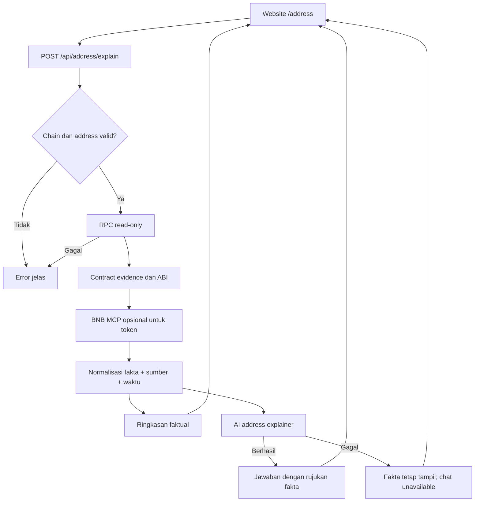

# Address Explainer - Plan

## Goal Capsule

- **Objective:** Pengunjung website dapat memahami fakta yang tersedia tentang sebuah address BNB Chain dan menanyakan artinya dalam bahasa sehari-hari, tanpa menerima keputusan keamanan transaksi.
- **Means:** Halaman website baru memanggil endpoint baca-saja yang mengumpulkan bukti, menormalkannya, lalu meminta AI menjelaskan hanya fakta yang memiliki rujukan (KTD1-KTD4).
- **Authority:** Batas produk di `PRODUCT.md` bagian "Planned website feature: Address Explainer" mengalahkan contoh implementasi di dokumen ini; `Design.md` memandu presentasi.
- **Stop condition:** Tidak ada perubahan pada alur extension, `security-check`, risk engine, MCP request/response yang sudah dipakai transaksi, atau `/demo`.

## Product Contract

### Summary

Tambahkan halaman `/address` untuk memilih BNB Mainnet atau Testnet, memasukkan address EVM, membaca fakta on-chain, dan bertanya tentang hasilnya. Fitur ini menerjemahkan data, bukan menilai apakah transaksi boleh ditandatangani.

### Problem Frame

Explorer dan hasil tool menampilkan data teknis yang sulit ditafsirkan pengguna awam. Menyalin verdict dari extension ke halaman address akan keliru karena halaman ini tidak memiliki intent maupun transaksi untuk dibandingkan.

### Key Decisions

- **Website terpisah dari extension.** Address Explainer tidak membutuhkan wallet atau transaksi; ini pilihan pengguna atas fitur website, bukan perluasan intersepsi. Governs R1, R8.
- **Penjelasan tanpa verdict.** AI menerjemahkan bukti, tidak mengeluarkan `ALLOW`, `REVIEW`, `BLOCK`, skor, atau klaim `SAFE`/`SCAM`; ini pilihan pengguna atas fitur penerjemah murni. Governs R4, R5.

### Requirements

**Input dan fakta**

- R1. Pengguna memilih secara eksplisit Chain ID 56 atau 97 dan memasukkan satu address EVM tanpa menghubungkan wallet.
- R2. Tiap fakta yang ditampilkan mempunyai sumber, waktu pemeriksaan atau blok bila tersedia, dan tautan explorer dari jaringan yang dipilih.
- R3. Data yang tidak dapat dibaca diberi status tidak diketahui; tidak adanya kode saat diperiksa tidak dilabeli pasti EOA.

**Penjelasan dan chat**

- R4. Ringkasan faktual muncul sebelum jawaban AI; jawaban menjelaskan hanya fakta yang dirujuk, membedakan observasi dari tafsiran, dan mengakui bukti yang kurang.
- R5. Tidak ada verdict keamanan, simulasi, intent matching, saran pasti membeli/mengirim/menandatangani, atau konversi nilai konfigurasi menjadi kerugian pasti.
- R6. Pertanyaan lanjutan memakai address dan chain yang sedang dipilih; mengganti salah satunya menghapus jawaban lama dari konteks aktif.

**Kegagalan, privasi, kompatibilitas**

- R7. Input tidak valid, jaringan tidak didukung, RPC/MCP/AI gagal, atau bukti kosong ditampilkan apa adanya; kegagalan AI tidak menghapus fakta yang sudah berhasil dibaca.
- R8. Address dan pertanyaan diproses oleh layanan website tanpa penyimpanan riwayat chat permanen di aplikasi; sebelum pemakaian, pengguna diberi tahu bahwa data dikirim ke layanan analisis.
- R9. Rute `/`, `/demo`, extension, dan respons `security-check` tetap bekerja seperti sekarang.

### Scope Boundaries

- **Dalam v1:** address EVM pada BNB Mainnet/Testnet, pembacaan read-only, fakta kontrak/token bila tersedia, penjelasan awam, dan pertanyaan lanjutan.
- **Di luar v1:** transaksi/hash sebagai input, rekomendasi investasi, audit kontrak, pelacakan saldo/riwayat menyeluruh, dukungan chain lain, database riwayat chat, dan klaim identitas pemilik address.

### Acceptance Examples

- AE1. **Covers R1, R2, R6:** Address yang sama pada chain 56 dan 97 menghasilkan pemeriksaan terpisah, explorer sesuai chain, dan chat sebelumnya tidak terbawa.
- AE2. **Covers R3, R5:** Respons RPC `getCode = 0x` ditulis sebagai "tidak ada kode yang terbaca saat diperiksa", bukan "EOA" atau "aman". Jika RPC gagal, statusnya "tidak diketahui".
- AE3. **Covers R4, R5:** `sellTax() = 9800` tetap nilai konfigurasi mentah kecuali satuan dan penerapannya terbukti; AI tidak menyebut kerugian 98% sebagai fakta.
- AE4. **Covers R7:** Saat MCP gagal tetapi RPC berhasil, fakta RPC tetap tampil dengan status MCP tidak tersedia. Saat AI gagal, fakta tetap tampil dan chat menyatakan penjelasan belum tersedia.

## Planning Contract

### Key Technical Decisions

- KTD1. **Endpoint sendiri, bukan `security-check`.** Buat rute `POST /api/address/explain` di backend Hono; validasi chain sebelum memakai `getPublicClient`, karena helper sekarang mengarahkan chain selain 56 ke Testnet. Gunakan `getChainConfig` untuk explorer, tanpa fallback silang jaringan.
- KTD2. **Normalisasi fakta di server.** Pakai pembacaan RPC dan `BscEvidenceProvider.inspectContract` yang ada. Pisahkan `codeAvailable: false` dari `null`, simpan asal fakta dan waktu baca, jangan kirim JSON MCP mentah. ABI dari registri protokol tidak boleh dipresentasikan sebagai verifikasi source Sourcify; capability dari ABI tidak membuktikan siapa yang mengendalikan fungsi.
- KTD3. **BNB MCP hanya enrichment opsional.** Pakai investigator yang ada hanya saat address terbukti relevan sebagai token; tampilkan status enrichment hanya bila pembacaan menghasilkan fakta. Nilai `PERCENT` dari pembacaan MCP `sellTax()`/`buyTax()` tidak cukup membuktikan satuan: pada halaman ini tampilkan nilai mentah sampai satuan diverifikasi secara terpisah.
- KTD4. **AI khusus address, tanpa otoritas keputusan.** Pakai client AI yang sudah ada, tetapi jangan pakai `generateSecurityExplanation`, karena input dan prompt-nya mengharuskan decision/risk score. AI menerima daftar fakta terpilih dan pertanyaan; respons terstruktur hanya berisi penjelasan dan ID fakta yang valid. Nama token, ABI, dan teks MCP diperlakukan sebagai data tidak tepercaya; AI tidak diberi tool atau hak eksekusi.
- KTD5. **Chat tanpa sesi server permanen.** Tiap pertanyaan mengirim chain, address, pertanyaan, dan riwayat UI yang dibatasi; backend membaca ulang fakta. Riwayat hanya membantu memahami percakapan, tidak menjadi sumber fakta. Frontend membatalkan atau mengabaikan respons lama ketika chain/address berubah; tampilkan waktu pemeriksaan terbaru.
- KTD6. **Batas layanan sebelum publik.** Validasi ukuran input, batasi waktu RPC/MCP/AI, dan batasi pemakaian endpoint AI pada lapisan deployment yang berlaku. CORS bukan pembatas biaya atau autentikasi. Jangan merilis endpoint AI publik sampai retensi pihak penyedia dan pembatasan pemakaian terkonfirmasi.

### High-Level Technical Design

Sketsa arah data, bukan spesifikasi fungsi. Jalur ini tidak memanggil simulator, risk engine, atau decision engine.

Kontrak respons hanya memuat `chainId`, `address`, `checkedAt`, daftar `facts` (ID, nilai, status, sumber), `unknowns`, `sourceStatus`, ringkasan faktual, dan jawaban AI opsional beserta ID fakta rujukannya. Tidak ada field `decision`, `riskScore`, atau rekomendasi aksi. Error menggunakan kode terpisah untuk input, jaringan, RPC, dan layanan penjelasan. Tautan explorer dibentuk hanya setelah chain lolos validasi.

```mermaid
stateDiagram-v2
  [*] --> Empty
  Empty --> Loading: submit
  Loading --> FactsReady: RPC berhasil
  Loading --> Error: input/RPC gagal
  FactsReady --> Answering: ajukan pertanyaan
  Answering --> FactsReady: jawaban atau AI gagal
  FactsReady --> Empty: ganti chain/address
  Answering --> Empty: ganti chain/address; abaikan respons lama
  Error --> Loading: coba lagi
```

### Risks and Dependencies

- `BscEvidenceProvider` memakai `Promise.allSettled`; `null` dapat berarti sumber gagal, bukan fakta negatif. Endpoint harus memeriksa kesehatan RPC dan tidak mengubah error menjadi label address.
- `BnbAgentInvestigator` saat ini memberi unit `PERCENT` untuk getter tax tanpa bukti skala. Guard tampilan di normalisasi khusus fitur ini; jangan mengubah perilaku security-check dalam pekerjaan ini.
- Status deployment Mainnet yang dicatat di `PRODUCT.md` belum membuktikan endpoint production saat ini siap. Kesiapan 56 dan 97 perlu diuji pada deployment fitur ini sebelum tautan publik ditampilkan.
- Penyedia AI/MCP dan layanan hosting dapat memiliki kebijakan retensi sendiri. Teks privasi final harus sesuai konfigurasi production yang benar, bukan asumsi dari ketiadaan database aplikasi.

## Implementation Units

### U1. Baca fakta address secara terpisah

- **Goal:** Endpoint menerima chain dan address valid lalu mengembalikan fakta read-only dengan sumber, waktu, ketidakpastian, dan explorer yang benar.
- **Requirements:** R1-R3, R7, R9; KTD1-KTD2.
- **Files:** `backend/src/routes/address-explainer.ts` (baru), `backend/src/services/address-inspector.ts` (baru), `backend/src/index.ts`, `backend/src/routes/__tests__/address-explainer.test.ts` (baru).
- **Approach:** Validasi sebelum akses RPC; gunakan provider dan config jaringan yang ada; normalisasi hanya field yang didukung bukti.
- **Test scenarios:** Chain 56/97 mengarah ke explorer masing-masing; address tidak valid/chain lain ditolak; `getCode=0x` berbeda dari RPC timeout; ABI tidak ada menghasilkan unknown, bukan klaim aman; kontrak dan address tanpa kode tidak tertukar.
- **Verification:** Tes route baru dan typecheck backend.

### U2. Perkaya bukti tanpa mencampur sumber

- **Goal:** Fakta token yang relevan dapat diperkaya oleh MCP tanpa menjadikan output tool mentah sebagai konten pengguna.
- **Requirements:** R2-R5, R7; KTD3.
- **Files:** `backend/src/services/address-inspector.ts`, `backend/src/routes/__tests__/address-explainer.test.ts`.
- **Approach:** Pakai investigator yang ada setelah klasifikasi address; simpan provenance per fakta dan status tidak tersedia saat enrichment gagal.
- **Test scenarios:** MCP berhasil pada token menambah fakta ternormalisasi; MCP gagal tidak menghilangkan fakta RPC; `sellTax=9800` tetap raw saat satuan belum terbukti; konflik `isContract` dengan RPC tidak berubah menjadi klaim EOA/kontrak tanpa penjelasan.
- **Verification:** Tes route baru dengan MCP stub dan tanpa MCP.

### U3. Jelaskan fakta dan jawab pertanyaan

- **Goal:** AI menjawab berdasarkan fakta pemeriksaan terkini, dengan rujukan valid dan tanpa verdict keamanan.
- **Requirements:** R4-R8; KTD4-KTD6.
- **Files:** `backend/src/services/address-explanation.ts` (baru), `backend/src/routes/address-explainer.ts`, `backend/src/services/__tests__/address-explanation.test.ts` (baru).
- **Approach:** Batasi input/riwayat, pisahkan instruksi dari metadata on-chain, verifikasi ID fakta pada output, dan pertahankan ringkasan deterministik bila AI gagal.
- **Test scenarios:** Pertanyaan tentang owner dijawab dari fakta owner yang ada; fakta tidak ada dinyatakan tidak diketahui; output AI dengan ID fakta palsu/verdict ditolak; token name berisi prompt injection tidak mengubah jawaban; timeout AI mempertahankan fakta tetapi tidak memalsukan jawaban.
- **Verification:** Tes service AI dan tes route error/timeout.

### U4. Tampilkan pengalaman website yang jelas

- **Goal:** Halaman `/address` menyediakan input, fakta, ketidakpastian, chat, dan sumber yang terbaca pada desktop maupun mobile.
- **Requirements:** R1-R9; KTD5.
- **Files:** `frontend/src/app/address/page.tsx` (baru), stylesheet halaman yang mengikuti `frontend/src/app/globals.css` dan `Design.md`, `frontend/src/lib/address-api.ts` (baru), `frontend/src/app/page.tsx` (tautan sekunder).
- **Approach:** Jangan pakai header dengan anchor `#problem` dan sejenisnya tanpa tujuan pada halaman baru; sediakan navigasi balik nyata, status kosong/loading/error, tombol retry, address ringkas dengan alamat penuh yang dapat disalin/dibuka, dan teks privasi sebelum submit. Respons lama tidak boleh menimpa chain/address baru.
- **Test scenarios:** Ganti chain saat request berjalan mengabaikan hasil lama; pertanyaan baru tetap pada address aktif; nilai panjang membungkus tanpa overflow; keyboard dan focus terlihat; RPC/MCP/AI unavailable diberi pesan yang berbeda; tautan Mainnet/Testnet menuju explorer yang benar.
- **Verification:** Build/typecheck frontend dan inspeksi browser pada lebar 320px, 360px, serta desktop; cek `/` dan `/demo` tetap bekerja.

### U5. Release gate dan dokumentasi operasi

- **Goal:** Fitur hanya dipublikasikan setelah biaya, privasi, dan perilaku dua jaringan diperiksa pada deployment sebenarnya.
- **Requirements:** R7-R9; KTD6.
- **Files:** `PRODUCT.md` (status fitur dan batas rilis), konfigurasi deployment yang memang dipakai bila perlu; jangan ubah route transaksi.
- **Approach:** Tetapkan batas pemakaian endpoint dan teks retensi sesuai penyedia yang terpasang; lakukan smoke test production 56/97 dan regression test security-check sebelum menautkan fitur sebagai tersedia.
- **Test scenarios:** Permintaan berulang melewati batas mendapat respons jelas; ketiadaan kredensial AI tidak menghasilkan penjelasan palsu; production kedua chain benar; endpoint security-check dan `/demo` tetap sama.
- **Verification:** Smoke test deployment, regresi backend, dan pemeriksaan privasi yang tertulis.

## Verification Contract

Jalankan setelah unit implementasi selesai; perencanaan ini tidak menjalankan tes.

| Gate | Perintah atau pemeriksaan | Bukti lulus |
|---|---|---|
| Backend baru | `cd backend && bun test src/routes/__tests__/address-explainer.test.ts src/services/__tests__/address-explanation.test.ts --timeout 30000` | Validasi, provenance, kegagalan, dan guard AI lulus |
| Regresi keamanan | `cd backend && bun test src/routes/__tests__/security.test.ts --timeout 30000` | Kontrak `security-check` tetap lulus |
| Typecheck backend | `cd backend && bunx tsc --noEmit` | Tidak ada error TypeScript baru |
| Build frontend | `cd frontend && bun run build` | Rute `/address`, `/`, `/demo` terbangun |
| Typecheck frontend | `cd frontend && bunx tsc --noEmit` | Tidak ada error TypeScript baru |
| Browser QA | Manual: `/address` pada mobile/desktop, keyboard, semua state dan tautan | Tidak ada overflow, tautan salah jaringan, kontrol mati, atau klaim verdict |
| Production | Request read-only terkontrol pada 56 dan 97, AI/MCP success dan failure | Respons dan sumber sesuai deployment; rate limit/retensi terverifikasi |

## Definition of Done

- U1-U3: Endpoint hanya mengembalikan fakta berprovenance atau error yang jujur; tidak ada verdict, `riskScore`, raw MCP, atau fallback chain diam-diam.
- U4: Halaman dapat dipakai tanpa wallet; chat, reset konteks, source link, loading/error/unknown, dan aksesibilitas dasar bekerja.
- U5: Kebijakan retensi dan pembatasan pemakaian yang nyata terdokumentasi; kedua chain diverifikasi pada deployment sebelum promosi fitur.
- Semua gate relevan pada Verification Contract lulus, `/demo` dan `security-check` tidak berubah, serta kode percobaan yang tidak terpakai dibuang.

## Appendix

- Dasar produk: `PRODUCT.md` bagian "Planned website feature: Address Explainer".
- Semantik kode address: [Ethereum JSON-RPC `eth_getCode`](https://ethereum.org/developers/docs/apis/json-rpc/) dan [OpenZeppelin FAQ tentang batas deteksi contract/EOA](https://docs.openzeppelin.com/contracts/5.x/faq).
- Jaringan: [BNB Chain JSON-RPC documentation](https://docs.bnbchain.org/bnb-smart-chain/developers/json_rpc/json-rpc-endpoint/) mencatat Chain ID 56 dan 97.
- Penanganan metadata tak tepercaya: [OWASP LLM Prompt Injection Prevention Cheat Sheet](https://cheatsheetseries.owasp.org/cheatsheets/LLM_Prompt_Injection_Prevention_Cheat_Sheet.html).
